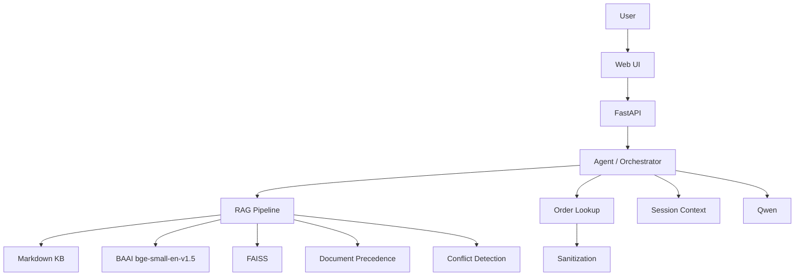

# Aster & Row AI Support Agent

## 1. Overview

This project is a local AI customer-support agent for the fictional ecommerce brand Aster & Row. It uses retrieval-augmented generation (RAG) over a Markdown knowledge base so answers stay grounded in company policy and product documentation. Order questions are handled through a separate JSON-backed lookup tool that returns a sanitized, customer-safe order view before anything reaches the model. The application runs locally with Hugging Face models, includes source citations, and adds guardrails for privacy, prompt injection, document precedence, and human handoff.

## 2. Key Features

- Knowledge-base RAG
- Metadata-aware document precedence
- Source citations
- Conflict detection
- Safe order lookup
- Order-data sanitization
- Multi-turn conversation
- Session isolation
- Prompt-injection resistance
- Human handoff
- Structured evaluation
- Minimal web UI

## 3. Architecture



## 4. Tech Stack

- Python 3.11+
- FastAPI
- Uvicorn
- Qwen/Qwen2.5-3B-Instruct
- Hugging Face Transformers
- BAAI/bge-small-en-v1.5
- sentence-transformers
- FAISS
- pytest
- HTML/CSS/JavaScript

The application does not require an OpenAI API key or any paid LLM or embedding API.

`Qwen/Qwen2.5-1.5B-Instruct` may be used as a local development fallback on machines with limited RAM. `Qwen/Qwen2.5-3B-Instruct` remains the intended assignment and submission model.

## 5. Requirements

- Python 3.9.13
- Internet access is needed on first run to download Hugging Face models.
- Enough local RAM is required to run the chosen Qwen model on CPU.

## 6. Quick Start

### Clone and create a virtual environment

```bash
git clone https://github.com/Govind-553/rag-support-agent.git
cd rag-support-agent

python -m venv .venv
.venv\Scripts\activate
pip install -r requirements.txt
```

### Choose your local model

Copy the example file:

```bash
copy .env.example .env
```

Default development fallback in `.env`:

```env
LLM_MODEL_NAME=Qwen/Qwen2.5-1.5B-Instruct
```

For final assignment/submission runs, switch to:

```env
LLM_MODEL_NAME=Qwen/Qwen2.5-3B-Instruct
```

### Build the FAISS index

```bash
python -c "from app.rag.loader import load_knowledge_base; from app.rag.index import FAISSIndex; from app.config import KNOWLEDGE_BASE_DIR, INDEX_DIR; chunks = load_knowledge_base(KNOWLEDGE_BASE_DIR); FAISSIndex(index_dir=INDEX_DIR).build(chunks); print(f'Index built: {len(chunks)} chunks')"
```

### Start the app

Either command works:

```bash
uvicorn app.main:app --reload
```

Open `http://127.0.0.1:8000` in your browser.

### Example API call

```bash
curl -X POST http://127.0.0.1:8000/api/chat ^
  -H "Content-Type: application/json" ^
  -d "{\"message\":\"Where is ORD-1007?\",\"session_id\":\"demo-1\"}"
```

## 7. Project Structure

```text
app/
  main.py
  orchestrator.py
  config.py
  models.py
  session.py
  rag/
  tools/
knowledge-base/
data/
evaluation/
static/
tests/
```

## 8. Running Tests

Fast suite:

```bash
python -m pytest tests/ -v --ignore=tests/test_rag.py
```

Full suite:

```bash
python -m pytest tests/ -v
```

Results from this audit pass on August 26, 2026:

- `python -m pytest tests/ -v --ignore=tests/test_rag.py` passed: `154/154`
- `python -m pytest tests/ -v` passed: `157/157`

## 9. Safety Notes

- Retrieved documents are filtered before generation so superseded, draft, and internal content is not treated as authority.
- Order lookup results are sanitized before they reach the prompt.
- Multi-turn context is session-scoped, and prior order IDs are reused only for clearly contextual follow-ups.
- Prompt instructions are separated from retrieved content and tool data.
- Conflicting authoritative sources trigger explicit conflict messaging and human handoff.

## 10. Manual Browser Testing

Good smoke tests:

- `Where is ORD-1007?`
- `When will it arrive?`
- `What is your standard return window?`
- `Please check ORD-9999.`
- `Can I put the Breeze Tumbler in the dishwasher?`

## 12. Bug Diary

See [BUG_DIARY.md](BUG_DIARY.md).
